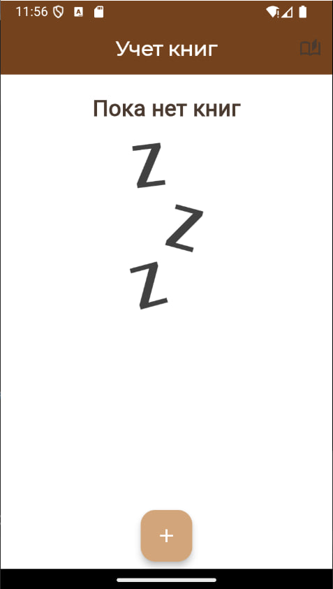
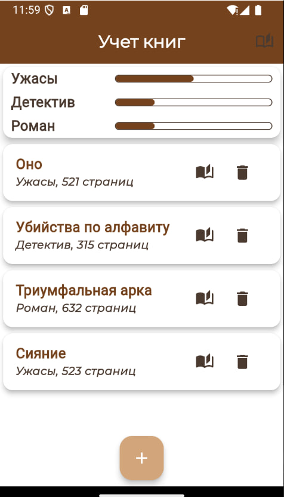
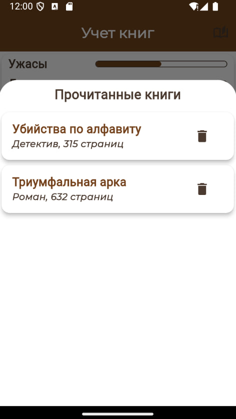

# Book Tracker App

Это приложение для учета книг, которое позволяет пользователям добавлять книги, отслеживать их жанры, количество страниц и отображать статистику по жанрам.

## Описание

Проект позволяет добавлять книги в приложение, указывая их жанр и количество страниц. Пользователи могут видеть статистику по жанрам в виде процентного распределения всех книг. Также можно пометить книги как "прочитанные", и они будут отображаться в отдельном разделе.

### Основные особенности:
- Добавление новых книг с указанием жанра и количества страниц.
- Отображение списка книг с кнопками для удаления и пометки как прочитанных.
- Отображение статистики по жанрам с процентным распределением.

## Технологии

- **Flutter**: основной фреймворк для разработки мобильного приложения.
- **Dart**: язык программирования, используемый для разработки приложения.
- **Material Design**: для создания красивого и современного интерфейса.

## Установка

Для того чтобы запустить это приложение на своем устройстве, выполните следующие шаги:

1. Убедитесь, что у вас установлен **Flutter SDK**. Если нет, скачайте его с официального сайта: [flutter.dev](https://flutter.dev/docs/get-started/install).
2. Клонируйте этот репозиторий:
   ```bash
   git clone https://github.com/wwwnnnnn04/book_tracking_app.git
3. Перейдите в директорию проекта:
   cd book-tracker-app
4. Установите зависимости:
   flutter pub get
5. Запустите приложение:
   flutter run

Скриншоты








Как использовать

1. Откройте приложение.
2. Добавьте книги, указав их жанр и количество страниц.
3. Используйте кнопки для пометки книги как прочитанной или для удаления.
4. Посмотрите статистику по жанрам на главной странице приложения.